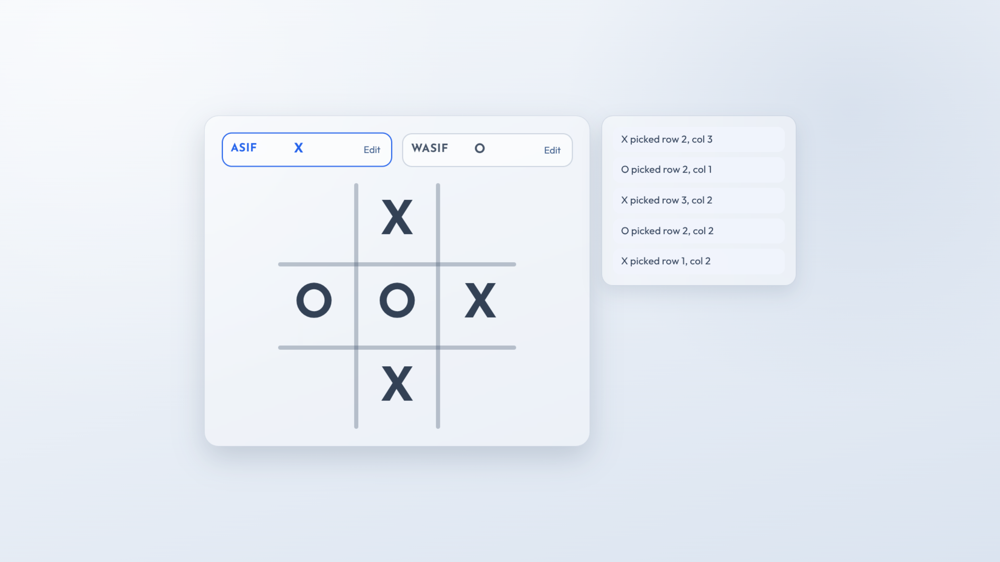

# Tic-Tac-Toe

A classic two-player Tic-Tac-Toe game built with React 19. Players take turns placing X and O on a 3x3 grid, competing to get three in a row.


## Screenshot



## Live Demo

[Play the game here](https://tic-tac-toe-bice-pi-66.vercel.app)

## Features

- **Two-player gameplay** — X and O take turns on the same device
- **Editable player names** — Click "Edit" to customize player names
- **Win detection** — Automatically detects all 8 winning combinations
- **Draw detection** — Announces a draw when all cells are filled with no winner
- **Move history** — Log panel shows every move made during the game
- **Instant rematch** — One-click reset to play again

## How It Works

The game follows standard Tic-Tac-Toe rules:

1. Player X always goes first
2. Players alternate placing their symbol in empty cells
3. First player to get 3 symbols in a row (horizontal, vertical, or diagonal) wins
4. If all 9 cells are filled with no winner, it's a draw

## Project Structure

```
src/
├── App.jsx              # Main game logic and state management
├── index.jsx            # React entry point
├── index.css            # Game styling
└── components/
    ├── index.js         # Barrel exports
    ├── Player.jsx       # Player info with editable names
    ├── GameBoard.jsx    # 3x3 clickable grid
    ├── GameOver.jsx     # Win/draw overlay with rematch
    ├── Log.jsx          # Move history display
    └── combinations.js  # Winning line definitions
```

## Technical Highlights

| Concept              | Implementation                                                 |
| -------------------- | -------------------------------------------------------------- |
| **State Management** | React `useState` for move history and player names             |
| **Derived State**    | Board state computed from move history (not stored separately) |
| **Immutability**     | `structuredClone` ensures original data is never mutated       |
| **Component Design** | Small, focused components with clear responsibilities          |
| **Props Pattern**    | Callback props for child-to-parent communication               |

## Getting Started

**Prerequisites:** Node.js 18+

```bash
# Install dependencies
npm install

# Start development server
npm run dev

# Build for production
npm run build
```

## Scripts

| Command           | Description                      |
| ----------------- | -------------------------------- |
| `npm run dev`     | Start local development server   |
| `npm run build`   | Create production build          |
| `npm run preview` | Preview production build locally |
| `npm run lint`    | Run ESLint code checks           |

## Tech Stack

- **React 19** — UI library
- **Vite** — Build tool and dev server
- **ESLint** — Code quality

## What I Learned

- Managing game state with React hooks
- Computing derived state instead of storing redundant data
- Structuring a React project with reusable components
- Handling user interactions and conditional rendering

---

Built as part of learning React fundamentals.
